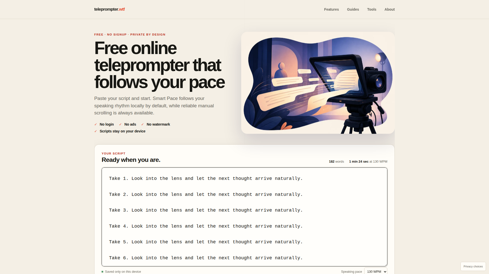
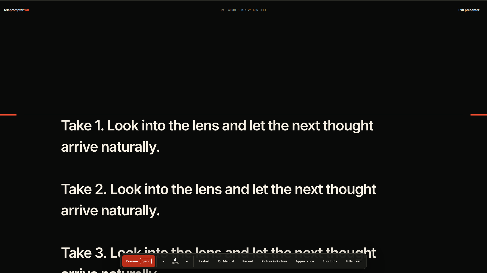
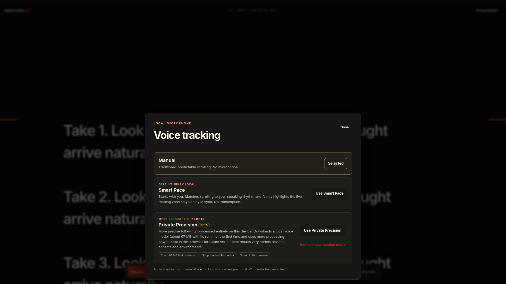

# teleprompter.wtf

**Paste. Present. Done. A teleprompter that can follow you without sending your script or voice to a server.**

## Live site

[teleprompter.wtf](https://www.teleprompter.wtf)

Source: [SABYA648/Telemprompter-WTF](https://github.com/SABYA648/Telemprompter-WTF)

## Why it exists

Opening a teleprompter should not begin with an account, a pricing wall, or a cloud upload. teleprompter.wtf keeps the basic job obvious: paste plain text, press Start, and present.

Manual mode stays independent from microphone, model, recording, analytics, and network availability. Advanced features appear only when requested.

## What makes it different

- No login, ads, subscription, database, or script backend
- Static-first Astro pages with focused Preact islands
- Smooth elapsed-time manual scrolling
- Smart Pace rhythm tracking without transcription
- Optional Private Precision Beta with local Whisper inference
- Browser-local screen and camera recording
- Progressive Picture in Picture with a pop-out fallback
- Local autosave, TXT import, mirror, vertical flip, focus guide, and keyboard control
- Consent-gated GA4 usage analytics, off by default
- Open source and directly deployable with Docker







## Features

The presenter includes play, pause, resume, restart, speed control, progress, remaining-time estimation, type size, line height, text width, alignment, focus position, horizontal mirror, vertical flip, fullscreen, keyboard shortcuts, recording, compact view, and voice tracking.

The editor restores local scripts after refresh, handles corrupt state safely, imports plain-text files locally, and reports word count and estimated speaking time.

## Voice tracking

### Smart Pace

Smart Pace requests the microphone only after a button press. It uses local Web Audio signal analysis, room calibration, adaptive thresholds, speech activity, silence timing, and smoothing. It never creates a transcript and downloads no model.

### Private Precision Beta

Private Precision Beta explicitly downloads a quantized multilingual Whisper Tiny model. Six-second microphone windows are transferred to a dedicated browser Worker. Temporary recognition fragments are aligned against a bounded region of the known script, then discarded. Low-confidence results hold position and leave cadence control to Smart Pace, which always runs alongside as fallback.

It is labeled Beta for honest reasons: alignment precision varies by device, accent, and environment, and first use downloads about 67 MB of model and runtime assets that are kept in the browser.

The pinned model assets total 45,233,651 bytes across 12 files. Together with the ONNX Runtime WASM files (about 21.6 MB) they form a single explicit download stored under a versioned Cache Storage key, removable from the voice panel. The true cold first-use transfer is 66,874,154 bytes (about 67 MB); warm-cache repeat activation transfers no model or runtime bytes. Remote model loading is disabled. See [docs/local-precision.md](docs/local-precision.md) and [docs/model-licenses.md](docs/model-licenses.md).

## Recording

Where browser APIs permit, the presenter records a selected display, window, tab, or camera. Microphone capture is optional. The output format is selected with `MediaRecorder.isTypeSupported()`, so the saved file is WebM or MP4 according to actual browser capability. Chunks become a local Blob for preview and saving. No upload endpoint exists.

## Picture in Picture

The compact presenter prefers Document Picture in Picture, then uses canvas-backed video Picture in Picture, then offers an ordinary pop-out. The pop-out is not described as always on top.

## Privacy

Scripts, microphone audio, recognition results, and recordings are processed on your device. They are not sent to the teleprompter.wtf application server.

Scripts and preferences can persist in local storage. Voice model files can persist in Cache Storage after explicit download. Microphone samples, recognition fragments, and recordings are not persisted by default.

Optional GA4 usage analytics can be enabled by the visitor and never loads before opt-in. Analytics use a fixed event vocabulary, IP anonymization, and no advertising storage, advertising signals, Google Signals, or user-provided data collection. See [docs/analytics.md](docs/analytics.md) and the public [privacy page](https://www.teleprompter.wtf/privacy).

## Analytics

Analytics are GA4 only, optional, and consent gated. Without a valid `PUBLIC_GA_MEASUREMENT_ID` at build time the output contains no GA code at all and the app is identical.

The analytics boundary accepts a fixed event allowlist and filters content-shaped properties. Direct `gtag()` calls outside the domain module are not allowed. Script, transcript, voice, filenames, clipboard contents, microphone labels, and raw error messages are prohibited. The full event taxonomy and privacy contract live in [docs/analytics.md](docs/analytics.md).

## Architecture

```text
src/
├── components/       Preact islands for the editor, presenter, media, and consent
├── content/          Hand-authored guide content with explicit update dates
├── domain/           State, DSP, alignment, capabilities, analytics, and media boundaries
├── layouts/          Shared metadata and page shell
├── pages/            Static product, guide, privacy, and tool routes
├── styles/           Responsive local CSS
└── workers/          Local Whisper inference Worker

scripts/
├── content-lint.mjs
├── fetch-local-model.mjs
├── prepare-runtime-assets.mjs
├── prune-build.mjs
├── revenue-estimate.mjs
└── verify-local-inference.mjs
```

The default page does not request model weights, ONNX Runtime WASM, analytics, recording code from a remote source, or microphone permission. Private Precision Beta is code-split behind its Worker and explicit user flow.

## Browser support

Manual mode targets current browsers with JavaScript and `requestAnimationFrame`. Advanced features are capability detected:

- Smart Pace needs microphone access and Web Audio.
- Private Precision Beta also needs Worker, WebAssembly, Cache Storage, memory, and local model initialization.
- Screen recording needs `getDisplayMedia` and MediaRecorder.
- Camera recording needs `getUserMedia` and MediaRecorder.
- Picture in Picture behavior varies substantially by browser.
- iOS and other constrained mobile browsers may suspend background audio, restrict compact windows, or expose fewer recording formats.

Unsupported advanced features do not block Manual.

## Development

Requirements: Node.js 22.12 or newer and npm 10 or newer.

```bash
git clone https://github.com/SABYA648/Telemprompter-WTF.git
cd Telemprompter-WTF
npm ci
npm run dev
```

Open `http://localhost:4321`.

Private Precision Beta local development also needs the pinned model:

```bash
npm run models:fetch
npm run dev
```

## Environment variables

Copy `.env.example` when optional integrations or verification metadata are needed:

```text
PUBLIC_GA_MEASUREMENT_ID=
PUBLIC_GOOGLE_SITE_VERIFICATION=
PUBLIC_BING_SITE_VERIFICATION=
```

All are public build-time identifiers, not secrets. An absent or invalid value fails closed: without a valid GA measurement ID the build contains no analytics code at all.

## Local voice model

`npm run models:fetch` downloads a fixed file list from one pinned model revision. Every file has an expected byte count and SHA-256 checksum. The deterministic destination is `public/models/whisper-tiny-v1/`. Generated model and runtime files are ignored by Git and included by the complete Docker build.

The normal production image includes Private Precision Beta. Operators who intentionally want a smaller static build can run `npm run build` without fetching model weights; Manual and Smart Pace still work, while the Private Precision Beta download reports unavailable same-origin assets.

## Testing

```bash
npm run typecheck
npm run lint
npm run content:lint
npm run format:check
npm test
npm run build
npx playwright install chromium
npm run test:e2e
```

`npm run check` runs typechecking, lint, content lint, formatting verification, unit tests, and a production build. Unit coverage includes scrolling, calculations, state migration, settings, Smart Pace signal behavior, script alignment, and analytics filtering. Playwright covers the editor, presenter, privacy canaries, consent gating, responsive layouts, media mocks, metadata, links, and accessibility. `npm run test:inference` verifies the real local inference path (worker, pinned model, ONNX Runtime) against the production Docker build with privacy canaries.

Permission-heavy CI tests use deterministic browser mocks. Those tests do not claim real operating-system capture or local-model performance.

## Docker deployment

The complete multi-stage build fetches and verifies the model, builds static Astro output, and serves it from unprivileged Nginx:

```bash
docker build -t teleprompter-wtf .
docker run --read-only --tmpfs /tmp:uid=101,gid=101 --tmpfs /var/cache/nginx:uid=101,gid=101 --tmpfs /var/run:uid=101,gid=101 -p 8080:8080 teleprompter-wtf
curl --fail http://127.0.0.1:8080/health
```

Or:

```bash
docker compose up --build -d
```

TLS, the HTTP-to-HTTPS redirect, and the apex-to-`www` redirect belong at the deployment edge. See [docs/deployment.md](docs/deployment.md) and [docs/coolify-deployment.md](docs/coolify-deployment.md).

## SEO architecture

Astro renders indexable content as static HTML. Every route has a unique title, description, canonical, H1, Open Graph metadata, and crawlable links. Guides include Article and Breadcrumb structured data. The build creates a canonical sitemap, while static `robots.txt` and curated `llms.txt` files expose discovery paths. `npm run content:lint` checks public copy, built metadata, JSON-LD, and internal links.

Research and launch operations are documented in [docs/seo-research.md](docs/seo-research.md) and [docs/seo-launch-checklist.md](docs/seo-launch-checklist.md).

## Project structure

Editorial routes remain static. Interactive code is isolated to the app and calculator islands. Browser capability decisions live in one domain helper. The scroll controller has no microphone or model dependency. Model acquisition is a build concern, while model activation is an explicit visitor choice.

## Product and engineering tradeoffs

### Why Smart Pace exists

Voice following should not cost a download. Smart Pace is the zero-download default: local Web Audio signal analysis tracks speaking rhythm without any model, transcription, or network dependency, so it works on first visit on modest hardware.

### Why Private Precision Beta is optional

Signal analysis cannot recognize words, so true position recovery needs speech recognition. That accuracy costs compute and a one-time download of about 67 MB (model plus ONNX Runtime WASM), and results still vary by device, accent, and environment. The feature is therefore an explicit opt-in labeled Beta, with Smart Pace always running alongside as fallback.

### Why speech stays local

A teleprompter script is often unpublished material: a keynote, a sermon, a legal statement. Keeping audio, recognition, and alignment on the device removes the largest privacy risk by construction and keeps the architecture simple: no inference server, no audio transport, no retention policy for data that never leaves the browser.

### Why static-first

The core job is rendering text and scrolling it. Astro static output with focused Preact islands delivers that with minimal JavaScript, fast first paint, indexable content for organic discovery, and hosting that is a plain file server or a small Nginx container. There is no backend to scale, patch, or breach.

### Why no login

Accounts exist to synchronize state or to gate payment. This product needs neither: scripts and preferences live in origin-local storage, and the product is free. Requiring an account would add friction and a data liability without adding capability.

### Why no ads yet

The launch goal is validating organic usage: whether people find the tool, start it, finish scripts, and return. Analytics exist to answer that before any monetization experiment. Ad slots, ad code, and ad revenue assumptions are documented as future options only; see [docs/monetization-readiness.md](docs/monetization-readiness.md).

## Contributing

Read [CONTRIBUTING.md](CONTRIBUTING.md). Preserve the core boundaries: no login, no ads, no cloud script storage, no remote speech inference, no user-content analytics, and no advanced feature on the critical rendering path.

## Security

Use GitHub private vulnerability reporting as described in [SECURITY.md](SECURITY.md). Do not put a private script, recording, identifier, or real voice sample in a public issue.

## License

Application source is available under the [MIT License](LICENSE). Model and runtime attribution is documented separately in [docs/model-licenses.md](docs/model-licenses.md).

.
